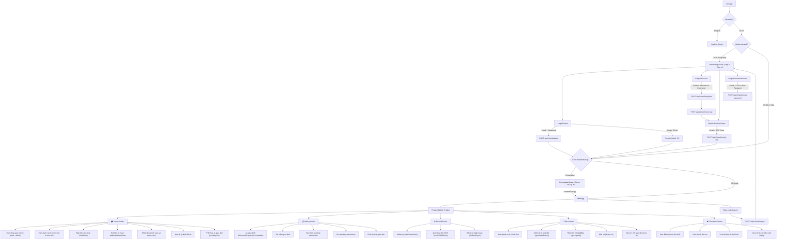

# WIVI - User Flow (Luồng người dùng)

## Tổng quan kiến trúc

WIVI là ứng dụng quản lý tài chính cá nhân theo hệ thống hũ (Jars). Hiện tại toàn bộ dữ liệu tài chính (jars, transactions, alerts, discipline) đang sử dụng **mock data cứng** trong `FinancialContext.tsx`. Phần Auth đã kết nối NestJS Backend + Supabase.

---

## Sơ đồ User Flow

---

## Chi tiết từng Screen

### 1. OnboardingScreen (Onboarding 5 bước)
| Bước | Nội dung | Dữ liệu cần |
|------|----------|-------------|
| Step 1 | Giới thiệu app | - |
| Step 2 | Giới thiệu tính năng | - |
| Step 3 | Đăng nhập / Đăng ký | Auth API |
| Step 4 | Thiết lập hũ tài chính ban đầu | `completeSetup()` → **CẦN API** |
| Step 5 | Hoàn tất | - |

### 2. HomeScreen (Trang chủ)
- Hiển thị tổng số dư (cash + bank)
- Danh sách hũ chi tiêu (spend jars) với progress bar
- Danh sách mục tiêu tiết kiệm (save jars/goals) với thanh tiến độ
- Giao dịch gần đây (3-5 giao dịch mới nhất)
- Thông báo (alerts) modal
- Nộp/Rút tiền mục tiêu
- Phân loại lại giao dịch

### 3. RecordScreen (Ghi nhận giao dịch)
- **Tab Nhập tay**: Chọn loại (income/expense), nhập số tiền, mô tả, chọn hũ
- **Tab Quét OCR**: Chọn hóa đơn → AI phân loại tự động
- **Tab Đồng bộ Bank**: Chọn ngân hàng → Đồng bộ giao dịch

### 4. HistoryScreen (Lịch sử giao dịch)
- Lọc theo loại: Tất cả / Thu nhập / Chi tiêu / Chưa phân loại
- Tìm kiếm theo mô tả
- Nhóm theo ngày (Hôm nay / Hôm qua / Ngày cụ thể)
- Xác nhận / Xóa giao dịch pending
- Phân loại lại giao dịch

### 5. JarsScreen (Quản lý hũ)
- Xem danh sách hũ chi tiêu với số dư
- Chỉnh tỷ lệ phân bổ (slider +/-), tổng phải = 100%
- Thêm hũ chi tiêu mới
- Xóa hũ (tự động phân bổ lại %)
- Xem chi tiết giao dịch từng hũ

### 6. DisciplineScreen (Kỷ luật tài chính)
- Điểm kỷ luật tài chính (0-100)
- Chuỗi streak liên tục (số ngày)
- Dự báo số dư cuối tháng
- Cảnh báo & Lời khuyên tài chính
